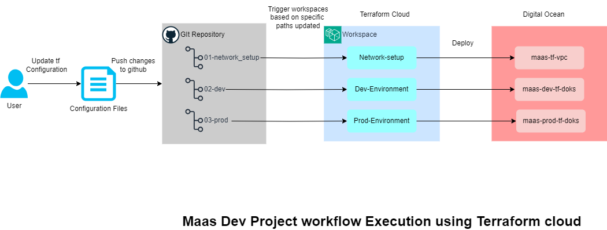

## Overview of Maas Dev Project 

This document provides a comprehensive guide for deploying a MaasDev infrastructure over DigitalOcean kubernetes Cluster, It includes the setup process for key components like network (VPC), gateway droplet, Doks (k8s cluster) and the bootstrapping of k8s addons such as monitoring (including Prometheus, Loki, Grafana, and Mimir), ingress Nginx controller, cert-manager, do-registry and static route operator.

All these components are created seamlessly through Terraform Cloud by pushing code to a GitHub repository, where Terraform Cloud workspaces will automatically trigger the deployment process.

#### Quickstart

To get started, sign up for a Terraform Cloud account and a DigitalOcean Cloud account if you haven't already. Then, simply follow the steps outlined in this guide to initiate the deployment process seamlessly. 

### Requirements and Prerequisites

1. DigitalOcean Cloud Account:
    - Sign up at (https://cloud.digitalocean.com/)

    - Pre-requisites 

        1. Digital ocean token
        2. Reserved IP for Gateway Droplet 
        3. SSH key for Gateway Droplet

    For detailed information follow this doc : 
    [Digital-ocean-prequisites](/documents/pre-requisite_digitalocean.md)

2. Terraform Cloud Account:

    - Sign up at https://app.terraform.io/

    - Create Organization, project and workspaces

    For detailed information follow this doc : 
    [Terraform-execution](/documents/Terraform-execution.md)

**Note: All values have already been parameterized. Any values that need to be passed externally should be set in the corresponding section within the env folder.**

## High Level overview Architecture Diagram : 

###  Below Deployment is Orchestrated for Terraform Cloud Execution 

#### Configured Workspaces in terraform cloud 

1. Network-Setup   
2. Dev-Environment
3. Prod-Environment
    

Refer this document for creation  : [Terraform cloud Execution Steps](/documents/Terraform-execution.md)

 ### Deploying the Network-setup

This setup will create a VPC and a gateway droplet, utilizing the VPC module in the modules section.

 File path : [Network-Setup](env/01-network_setup/)

1. **Configure Network Deployment:**

    - Fill in the necessary information in the main.tf file inside the 01-network_setup folder.

2. **Deploy the Network:**

    - Push the changes to the GitHub repository. Terraform Cloud workspaces will automatically trigger the changes from the GitHub repo and deploy the network in DigitalOcean.

 ### Deploying the Dev environment:

This module creates a DOKS cluster and deploys the necessary components such as the nginx-ingress-controller, cert-manager, do-registry-set, static-route-operator, and monitoring and utilizing the doks and doks-bootstrap module in the modules section. 
 
 File path : [Dev-Environment](env/02-dev/)

### **Configure Dev Environment Deployment:**
1. **Configuration:**
    - Fill necessary information in the main.tf file , 01-doks.tf and 02-doks-bootstrap.tf files inside the 02-dev folder.

2. **Deploy the Dev Environment:**

    - Push the changes to the GitHub repository. Terraform Cloud workspaces will automatically trigger the changes from the GitHub repo and deploy the dev cluster in DigitalOcean with configured monitoring.

### Deploying the Prod environment:

This module creates a DOKS cluster and deploys the necessary components such as the nginx-ingress-controller, cert-manager, do-registry-set, static-route-operator, and monitoring and utilizing the doks and doks-bootstrap module in the modules section.
 
 File path : [Prod-Environment](env/03-prod/)

### **Configure Prod Environment Deployment:**

1. **Configuration:**
    - Fill necessary information in the main.tf file , 01-doks.tf and 02-doks-bootstrap.tf files inside the 03-prod folder.

2. **Deploy the Dev Environment:**

    - Push the changes to the GitHub repository. Terraform Cloud workspaces will automatically trigger the changes from the GitHub repo and deploy the prod cluster in DigitalOcean with configured monitoring.

### Overview of Terraform cloud execution :

### After Installation steps for connecting both environment Monitoring 

1. Add Application dashboards ( tst, acc and Prod) 
2. Add data sources for prod monitoring components ( loki and prometheus)
3. For setting up probes to check application health endpoints 

Refer this document for detailed steps : 
[After-Installation-Steps](documents/After_installation_steps.md)

### Monitoring with DOKS-Bootstrap Module

The doks-bootstrap module is also utilized for monitoring, deploying various tools and services:

 - Loki for logs
 - Prometheus for metrics
 - Mimir for storing metrics
 - Blackbox Exporter to check application health status
 - Grafana for visualizing metrics and logs using dashboards

The related code can be found in the doks-bootstrap folder under addons/monitoring.

### Monitoring overview : 

### For configuring static route operator

Additionally, this module deploys a **static route operator** to route outbound traffic through a static reserved IP. 

You can find its configuration in the doks-bootstrap folder under addons/static-route-operator.

The destination IP is specified in the doks-bootstrap.tf file within the env folder for both 02-dev and 03-prod.

### Overview of Static-route-operator :

### Documents

- [Architecture Diagrams](/documents/Architecture.md)
- [Digitalocean pre-requisite](/documents/pre-requisite_digitalocean.md)  
- [After Installation steps for montoring connection](/documents/After_installation_steps.md)
- [Terraform cloud Execution Steps](/documents/Terraform-execution.md)
- [Directory Structure](/documents/Directory_structure.md)

